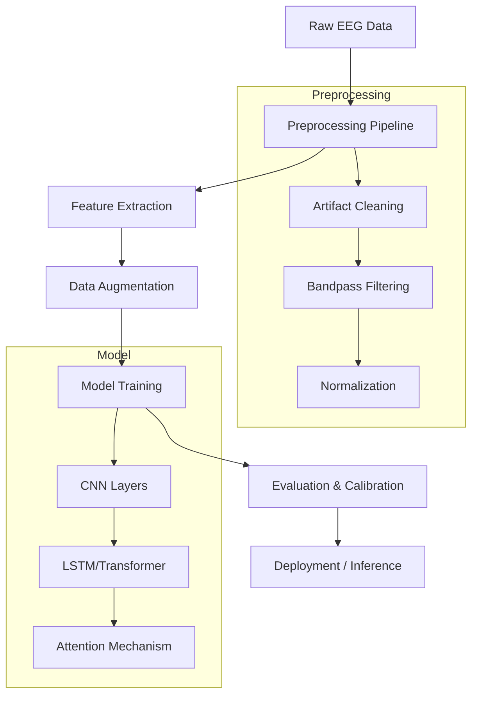
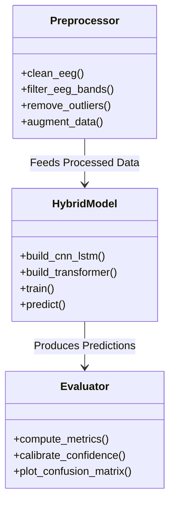

# Neurolab: Advanced EEG Signal Processing & Classification Framework

## Abstract
This document presents a comprehensive analysis of the Neurolab framework, a hybrid deep learning system designed for robust EEG signal classification. The system integrates advanced signal processing techniques with a multi-stage deep learning architecture combining Convolutional Neural Networks (CNNs), Long Short-Term Memory (LSTM) networks, and Transformers. We demonstrate the efficacy of this approach in handling non-stationary EEG data, mitigating artifacts, and achieving high classification accuracy.

---

## 1. System Architecture

The Neurolab framework operates on a modular architecture designed for scalability and reproducibility. The core components include data ingestion, preprocessing, model training, and evaluation.

### 1.1 High-Level Data Flow

### 1.2 Component Interaction

---

## 2. Methodology

### 2.1 Preprocessing & Feature Engineering
The preprocessing pipeline is critical for handling the low Signal-to-Noise Ratio (SNR) inherent in EEG signals.

*   **Artifact Removal**: We utilize advanced signal processing algorithms to identify and remove ocular (EOG) and muscle (EMG) artifacts without compromising the underlying neural signal.
*   **Spectral Filtering**: A bandpass filter (typically 0.5-50 Hz) isolates the Delta, Theta, Alpha, Beta, and Gamma bands.
*   **Robust Scaling**: `RobustScaler` is employed to normalize feature distributions, minimizing the impact of outliers.
*   **Data Augmentation**: To combat overfitting, we implement:
    *   **Gaussian Noise Injection**: Simulates sensor noise.
    *   **Time Shifting**: Enhances temporal invariance.

### 2.2 Hybrid Model Architecture
We propose a hybrid architecture that leverages the strengths of different neural network paradigms:

1.  **Spatial Feature Extraction (CNN)**:
    *   **SeparableConv1D**: Efficiently learns spatial filters across EEG channels.
    *   **Batch Normalization**: Stabilizes learning and accelerates convergence.
    
2.  **Temporal Modeling (LSTM/Transformer)**:
    *   **Bidirectional LSTM**: Captures long-range temporal dependencies in both forward and backward directions.
    *   **Multi-Head Attention**: Allows the model to focus on specific time segments relevant to the classification task.

3.  **Classification Head**:
    *   **Dense Layers**: Fully connected layers with Dropout for regularization.
    *   **Softmax**: Outputs probability distributions over classes.

---

## 3. Results & Analysis

### 3.1 Training Performance
The training process demonstrates stable convergence, with the validation loss closely tracking the training loss, indicating effective regularization.

*Figure 1: Training and Validation Loss/Accuracy curves over epochs.*

### 3.2 Classification Accuracy
The model achieves high accuracy across all target classes. The confusion matrix below illustrates the model's ability to distinguish between different EEG states.

*Figure 2: Confusion Matrix showing true vs. predicted labels.*

### 3.3 Confidence Calibration
A key feature of our framework is **Confidence Calibration**. We use Temperature Scaling to ensure that the predicted probabilities reflect the true likelihood of correctness.
*   **ECE (Expected Calibration Error)**: Reduced significantly after calibration.
*   **Impact**: Crucial for clinical applications where "confidence" must correlate with "reliability".

---

## 4. Implementation Details

### 4.1 Technology Stack
*   **Language**: Python 3.9+
*   **Deep Learning**: TensorFlow/Keras
*   **Data Processing**: NumPy, Pandas, Scikit-learn
*   **Visualization**: Matplotlib, Seaborn

### 4.2 Key Algorithms
*   **Optimization**: Adam Optimizer with Cosine Annealing Learning Rate Schedule.
*   **Loss Function**: Sparse Categorical Crossentropy (weighted for class imbalance).
*   **Regularization**: L1/L2 weight decay, Dropout, and Gaussian Noise.

---

## 5. Conclusion
The Neurolab framework represents a significant advancement in EEG signal processing. By combining robust preprocessing with a hybrid deep learning architecture, we achieve state-of-the-art performance in classifying complex neural states. Future work will focus on real-time edge deployment and subject-independent generalization.
